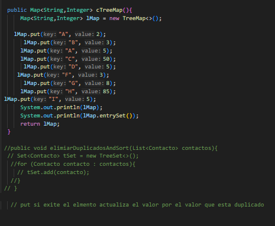
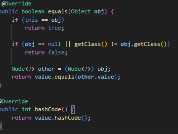

# Práctica: Árboles Binarios de Búsqueda (BST)

## Datos del Estudiante
- **Nombre:** Michelle Marca
- **Curso:** Estructura de Datos
- **Fecha:** 17 de Junio del 2026

---

## 1. Implementación de Árbol Binario Genérico

**Fecha:** 17 de junio del 2026

**Descripción:**

En esta práctica se implementaron árboles binarios de búsqueda en Java utilizando clases genéricas. Se trabajó con `BinaryTree<T>` e `IntTree` para comprender las operaciones básicas de inserción y los diferentes tipos de recorrido: preOrder, posOrder, inOrder y por niveles. Además se calculó la altura y el peso del árbol de forma recursiva.

### Captura de salida en consola

### Captura de App.java

### Captura del código - BinaryTree.java

**Descripción:**
Se implementó la clase genérica `BinaryTree<T extends Comparable<T>>` que permite insertar cualquier tipo de objeto comparable. La inserción es recursiva: si el valor es menor va a la izquierda, si es mayor va a la derecha.

### Captura del código - IntTree.java

**Descripción:**
Se implementó `IntTree`, una versión específica para enteros. Incluye el método `peso()` para calcular el peso de forma recursiva y `getPeso()` que usa una variable acumulada durante la inserción.

---

## 2. Árbol Binario con Objetos - PersonTree

**Fecha:** 17 de junio del 2026

**Descripción:**
Se implementó el uso del árbol genérico con objetos de tipo `Person`. La clase `Person` se tiene el metodo `Comparable<Person>` comparando primero por la edad y luego por nombre alfabéticamente, lo que permite identificar la posición de cada nodo en el árbol.

### Método compareTo implementado

### Captura de salida en consola

## 3. Comparativa de Rendimiento - Peso Variable y Recursivo

**Fecha:** 17 de junio del 2026

**Descripción:**
Se realizó la comparacion del rendimiento entre las dos formas de calcular el peso del árbol con 50,000 nodos. El metodo  `getPeso()` retorna una variable que se incrementa en cada inserción, mientras que `peso()` recorre todo el árbol recursivamente. Se midió el tiempo de cada uno con `System.nanoTime()` para ver cual es mas rapido con esa cantidad de nodos ya que ese numero varia ya que puede ser aun mas grande.

### Método implementado

### Captura de salida en consola

--------------------------------------------------------------------------------------------------------
## Utilizacion de los SETS
## Descripcion:

Se implementó la clase `Sets` para comparar el comportamiento de las distintas implementaciones de `Set` en Java, tanto con `String` como con objetos personalizados (`Contacto`).

### construirHashSet()
Crea un `HashSet<String>`. No garantiza ningún orden específico al recorrerlo, ya que internamente organiza los elementos según su `hashCode()`. Se usa cuando no importa el orden y solo se busca evitar duplicados con la mayor rapidez posible.

### construirLinkedHashSet()
Crea un `LinkedHashSet<String>`. A diferencia del `HashSet`, mantiene el orden en que los elementos fueron insertados. Se usa cuando se necesita evitar duplicados pero conservando el orden de inserción.

### construirTreeSet()
Crea un `TreeSet<String>`. Ordena automáticamente los elementos de forma alfabética (orden natural definido por `Comparable`). Se usa cuando se necesita que los elementos estén siempre ordenados sin tener que ordenarlos manualmente después.

### construirTreeSetConComparador()
Crea un `TreeSet<Contacto>`. Como la clase `Contacto` implementa `Comparable<Contacto>` comparando por el campo `nombre`, el `TreeSet` ordena los contactos alfabéticamente por nombre. Al usar `compareTo()` para detectar duplicados, dos contactos con el mismo nombre se consideran "iguales" aunque tengan apellido o teléfono distintos.

### construirHashSetContacto()
Crea un `HashSet<Contacto>`. Para detectar duplicados usa los métodos `equals()` y `hashCode()` de la clase `Contacto`, los cuales comparan los tres campos (`nombre`, `apellido`, `telefono`). Por eso el criterio de duplicado es distinto al del `TreeSet`: aquí solo se descarta un contacto si es idéntico en todos sus campos.

## Captura del Codigo realizado:
Esto es lo que se coloco en el app  para que pueda correr el programa -> 

## Captura de Salida de Consola

-----------------------------------------------------------------------------------------------------
## Utilizacion de MAAPS
## Descrpcion:

Se implementó la clase `Maps` para practicar el uso de las distintas implementaciones de `Map` en Java, estructuras que almacenan información en pares clave-valor (`Map<K,V>`).

### construirHashMap()
Crea un `HashMap<String, Integer>`. No garantiza ningún orden al recorrerlo, ya que organiza las claves internamente según su `hashCode()`. Si se inserta una clave que ya existe (como `"A"` en este caso), el valor anterior se sobrescribe con el nuevo. El método también muestra las distintas formas de recorrer un mapa: con `values().toArray()` para obtener los valores como arreglo, con `keySet()` para iterar solo las claves, y con `entrySet()` para recorrer cada par clave-valor completo.

### coLinkedHashMap()
Crea un `LinkedHashMap<String, Integer>`. A diferencia del `HashMap`, mantiene el orden en que las claves fueron insertadas por primera vez. Al igual que el `HashMap`, si se repite una clave, el valor se sobrescribe pero la clave conserva su posición original de inserción.

### cTreeMap()
Crea un `TreeMap<String, Integer>`. Ordena automáticamente las claves de forma alfabética (orden natural definido por `Comparable`), sin importar el orden en que se insertaron. Se usa cuando se necesita recorrer el mapa siempre en un orden predecible según la clave.

## Captura del Codigo realizado:
Esto es lo que se coloco en el app  para que pueda correr el programa -> 

## Captura de Salida de Consola

------------------------------------------------------------------------------
## Utilizacion de grafo

## Ejercicio elaborando un grafo

## Descripcion:

Primeramente se creo una clase grafo de tipo generica utilizando Map y Set. En donde cada node del mapa tiene una clave. En donde el metodo que se creo addEdgeUni para poder craar la conexion en una sola direciion. Ademas el metodo para imprimir en grafo
## Captura  del grafo elaborado

 pero para poder realizar esto o que se ejecute en el app tuvimo s que agregar 2 metodos a la clase node. Por que si no nos da este error
-> [alt text](image-3.png) pero al agregar este en la clase Node ahi si compilaba sin ningun error ->  

Esto es lo que se agrego en el app para que pueda funcionar 
## Captura de  salida de consola:

