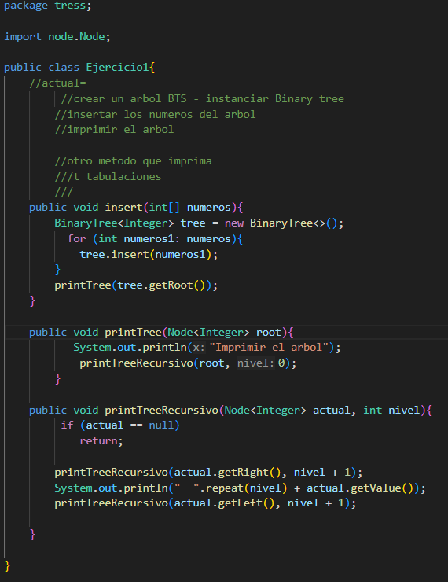
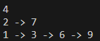

# Práctica: Árboles Binarios de Búsqueda (BST)

## Datos del Estudiante
- **Nombre:** Michelle Marca
- **Curso:** Estructura de Datos
- **Fecha:** 17 de Junio del 2026

## Primer Ejercicio

En este ejercicio realizamos el insertar numeros en un arbol mediante un arreglo de numeros el cual se coloco en el app. Despues en consola se observo el el orden que estaba el arbol.
en este el metodo printTree realiza la impresion del arbol de forma vertical, de forma que se visualiza tambien por niveles.

## Salida de Consola

## Segundo Ejercicio

En este segundo ejercicio imprimimos primero el arbol original, para despues por el metodo invertRecursively invertir el arbol de manera que los nodos que iban a la izquierda esten en la derecha como tambien los de la derecha esten en la izquierda, se podria decir que casi  es parecido con el ejercicio 1
 
## Salida de Consola ejercicio 2

## Tercer Ejercicio

En este ejercicio 3, el metodo que se genero hace de recorer por niveles del arbol binario.Y desoues del rrecorrido se visualiza una lista  de todos los nodos que hay en ese arbol, pero ordenados de izquierda a derecha es como se visualiza en el arreglo.

## Salida de consola ejercicio 3

## Cuarto Ejercicio
En el ejercicio 4 tenemos el ejecico que nos ayuda a calcular la profundidad DFS en donde el nodo es igual a 0 cuando no hay nada que contar, pero cuando si hay que contar mide la profundidad del hijo izquierdo y despues del hijo derecho. Despues de eso se queda con la rama mas larga.

## Salida de consols ejercicio 4 
